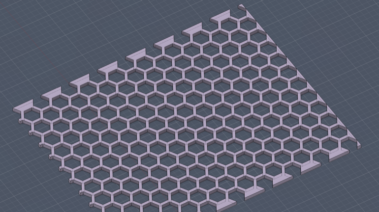

# HexPattern – Honeycomb Cut Pattern

**HexPattern** creates a honeycomb pattern of hexagonal cuts on a selected rectangular face. Great for ventilation grilles, decorative panels, speaker covers, or lightweight structures.

## Features

- Flat-top or pointy-top hexagon orientation
- Configurable number of hexagons across the width
- Adjustable margin/gap between hexagons
- Option to cut partial hexes at edges or only full hexes
- Live hex width preview in the dialog
- Cuts through the entire body thickness

## Usage

1. Select an edge on a rectangular face — this edge defines the "width" direction for hex count
2. Run **HexPattern** from **Scripts and Add-Ins** (`Shift+S`)
3. Configure options in the dialog:
   - **Number of Hexes**: How many hexagons across the selected edge
   - **Hex Width**: Displays the calculated width of each hexagon
   - **Margin**: Gap between hexagon edges
   - **Orientation**: Flat Top or Pointy Top
   - **Cut partial hexes at edges**: Include partial hexes at boundaries, or only full hexes
4. Click **OK** to create the pattern

## How Sizing Works

- The hexagon size is calculated so that the specified number fits along the selected edge
- The margin parameter creates gaps between adjacent hexagon edges
- Rows alternate with a half-column offset (standard honeycomb pattern)
- With "Cut partial hexes" disabled, only complete hexagons are cut

## Notes

- Works best with rectangular or near-rectangular faces
- The selected edge determines which direction the hex count applies to
- Very large margins relative to face size may result in fewer hexagons fitting
