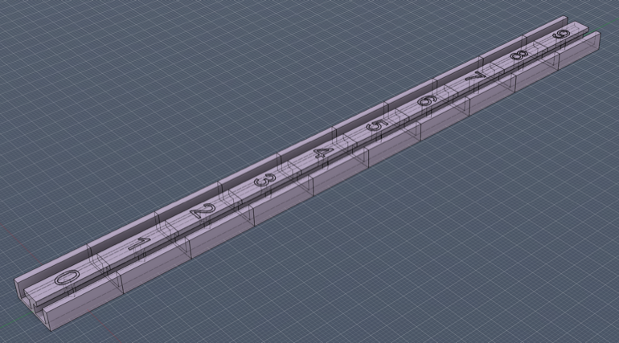

# PatternedCount – Automatic Numbering for Patterned Counter Segments

**PatternedCount** is a Fusion 360 add-in that automatically generates correctly spaced and styled numbering for sliding counters, dial indicators, deck-box life counters, and other patterned components. Intended for use with multi color 3d prints.

The add-in reads your user parameters and a single template Sketch Text entity, then creates the full numbered sequence by duplicating, positioning, and formatting text for each segment. Existing number graphics are deleted and regenerated cleanly every time you run the add-in.

This is ideal for multi-material 3D printed projects where each digit needs its own cutout and body.

## Features

- Uses **one master Sketch Text** as a styling and alignment template
- Generates a complete sequence of numbers (e.g., `0–9`, `1–10`, padded forms)
- **Two placement modes:**
  - **Linear mode:** Places numbers along a straight line at `i * pcSegmentPitch`
  - **Circular mode:** Places numbers around a circle, evenly spaced
- Respects the template's font, size, rotation, alignment, position relative to geometry
- Automatically deletes previously generated digits
- Fully parameter-driven — **no GUI**, no prompts
- Can cut and create new bodies using `pcCutDepth`
- Names all created bodies with numbers (`n0` for example)

## Usage

### Linear Mode

1. Create a sketch on the face where you want the numbers.
2. Add **one Sketch Text** item (the template) positioned exactly where the first digit belongs.
   - Style it however you like (font, bold, alignment, etc.).
   - This single item is the _reference_ for all generated digits.
3. Set up your parameters (`pcSegmentCount`, `pcSegmentPitch`, `pcStartNumber`, etc.).
4. Select the sketch in the browser (or edit it).
5. Run **PatternedCount** from **Scripts and Add-Ins** (`Shift+S`).
6. The add-in will:
   - Update your template text to show `pcStartNumber`
   - Delete all previously generated texts (only those created by the add-in)
   - Create new digits for all remaining segments
   - Optionally create cuts and bodies if `pcCutDepth` is set
7. Your existing extrude features will update automatically.

### Circular Mode

1. Create a sketch on the face where you want the numbers.
2. Draw a **guide circle** at the desired radius for the numbers.
   - The guide circle will be automatically converted to construction geometry to avoid interfering with profiles.
3. Add **one Sketch Text** item (the template) positioned on the circle where the first digit belongs.
4. Set up your parameters (`pcSegmentCount`, `pcStartNumber`, optionally `pcArcDirection`).
5. **Select the guide circle**, then run **PatternedCount**.
6. The add-in will:
   - Detect circular mode from the selected circle
   - Position each number evenly around the circle (360° ÷ segment count)
   - Rotate each number to follow the circle's tangent
   - Create cuts and bodies if `pcCutDepth` is set

Whenever you change parameters, simply run **PatternedCount** again.

## User Parameters

Create these parameters in **Modify → Change Parameters**.

**Important:** Integer parameters must be created as **unitless** (leave the Unit field blank or select "No Unit"). Using a text parameter or adding units will cause errors.

### Required Parameters

| Name             | Type           | Description                                               |
| ---------------- | -------------- | --------------------------------------------------------- |
| `pcSegmentCount` | Unitless (int) | Number of segments (e.g., `10` for digits 0–9).           |
| `pcStartNumber`  | Unitless (int) | First number in the sequence (e.g., `0`).                 |

### Linear Mode Parameters

| Name             | Type   | Description                                                      |
| ---------------- | ------ | ---------------------------------------------------------------- |
| `pcSegmentPitch` | Length | Center-to-center spacing between segments (e.g., `6 mm`).        |
| `pcDirection`    | Text   | Direction to place numbers: `+X` (default), `-X`, `+Y`, or `-Y`. |

### Circular Mode Parameters

Circular mode is automatically enabled when the sketch contains a **guide circle**.

| Name             | Type | Description                                              |
| ---------------- | ---- | -------------------------------------------------------- |
| `pcArcDirection` | Text | Direction around the circle: `CCW` (default) or `CW`.    |

### Optional Parameters

| Name          | Type   | Description                                                           |
| ------------- | ------ | --------------------------------------------------------------------- |
| `pcCutDepth`  | Length | If set, creates cuts and new bodies for each number (e.g., `0.4 mm`). |

## Notes

- The add-in does _not_ run automatically when parameters change (Fusion 360 limitation). You must run it manually after adjusting parameters.
- In circular mode, the guide circle is automatically converted to construction geometry. This prevents it from creating unwanted profiles that would interfere with character cutouts (like the center of "0" or "8").
